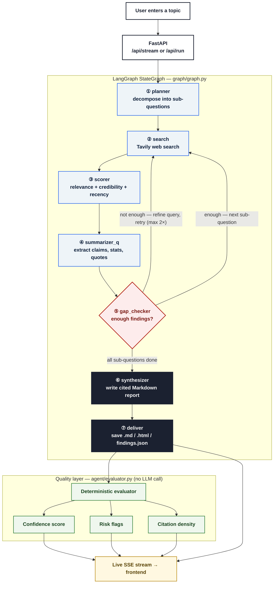

# 🔬 AI Research Agent

[](https://python.org)
[](https://fastapi.tiangolo.com/)
[](https://github.com/langchain-ai/langgraph)
[](https://groq.com/)
[](https://tavily.com/)
[](LICENSE)

**An autonomous research agent that decomposes a topic into sub-questions, searches the web for each one, drops low-credibility sources, self-corrects when evidence is thin, and writes a cited report — plus a deterministic, non-LLM score of how trustworthy that report actually is.**

🔗 **[Live Demo](https://YOUR-VERCEL-URL.vercel.app)** · **Backend API:** `https://YOUR-RAILWAY-URL.up.railway.app`

---

## Why this exists

Most "research agent" side projects are one LLM call wrapped around a search API — ask a question, get five links summarized into a paragraph, done. Two things are usually missing: **a real self-correction loop** (if the first search comes back thin, does the agent actually notice and try again?), and **any honest signal about how much to trust the output** (is this report backed by five independent sources, or one blog post re-worded five ways?).

This project builds both in as first-class parts of the pipeline, not an afterthought:

- **Self-correction is structural, not prompted.** A dedicated `gap_checker` node checks whether a sub-question has enough credible findings; if not, it asks the LLM to rewrite the query with a different angle and re-searches — up to a configurable retry limit — before moving on.
- **Trust is scored, not asserted.** A separate, deterministic evaluator (no LLM call, just arithmetic over the retrieved findings) computes a confidence score, source/domain diversity, citation density, and explicit risk flags for every run — e.g. *"low domain diversity — findings may come from a narrow source base."* The report never claims to be more reliable than the evidence behind it actually supports.

---

## Architecture



> **Reading the diagram:** solid arrows are fixed steps. The `gap_checker` diamond is the one decision point in the whole graph — it either loops back to search (with a rewritten query, capped at 2 retries) or moves on. Once all sub-questions clear that gate, the pipeline synthesizes and saves the report, then the quality layer scores it independently.

---

## Pipeline stages

| # | Node | What happens |
|---|---|---|
| 1 | **planner** | Groq breaks the topic into up to 6 focused sub-questions plus a matching report outline |
| 2 | **search** | Tavily (advanced search depth) returns up to 5 results per query: title, URL, content, relevance score, published date |
| 3 | **scorer** | Composite score per source — `0.5×Tavily relevance + 0.3×domain credibility + 0.2×recency` — no LLM call; sources below `0.6` are dropped |
| 4 | **summarizer_q** | Each surviving source is sent to Groq to extract structured key claims, statistics, and a supporting quote — sources judged irrelevant are discarded here |
| 5 | **gap_checker** | If findings for this sub-question are below `MIN_CREDIBLE_SOURCES`, the LLM rewrites the query and the loop returns to `search` (capped at `MAX_SEARCH_LOOPS`); otherwise advances to the next sub-question |
| 6 | **synthesizer** | One final Groq call weaves every sub-question's findings into a coherent, cited Markdown report |
| 7 | **deliver** | Saves Markdown, HTML, findings JSON, and a quality JSON to disk; the FastAPI layer also streams the same data live via SSE |

Steps 2–5 repeat once per sub-question — a 6-question run produces the four-line `search → scorer → summarizer → gap_checker` pattern six times before synthesis ever runs.

---

## Tech stack

| Layer | Choice | Notes |
|---|---|---|
| Orchestration | **LangGraph** `StateGraph` | 7 nodes, 2 conditional edges (planner error-guard, gap-check routing) |
| LLM | **Groq** `llama-3.3-70b-versatile` | OpenAI-compatible API; used for planning, per-source extraction, query refinement, and synthesis |
| Web search | **Tavily Search API** | direct HTTP client, advanced search depth |
| Backend | **FastAPI** + Uvicorn | REST (`/api/run`) and Server-Sent Events (`/api/stream`) |
| Streaming | **SSE** via LangGraph `.stream(stream_mode="updates")` | one event per node — the mechanism behind the live pipeline log in the UI |
| Quality evaluation | Custom evaluator, **no LLM** | confidence score, source/domain diversity, citation density, risk flags — pure arithmetic over structured findings |
| Frontend | Static HTML/CSS/JS | no build step, consumes the SSE stream directly via `fetch` + `ReadableStream` |
| Deployment | **Split architecture** — backend on Railway, frontend on Vercel | see below |

---

## Deployment

The backend and frontend are deployed independently, communicating over CORS-scoped HTTPS:

| Component | Platform | What it serves |
|---|---|---|
| **Backend** | [Railway](https://railway.app) | FastAPI app — `/api/stream`, `/api/run`, `/api/report/{name}`, `/api/health` |
| **Frontend** | [Vercel](https://vercel.com) | Static `frontend/index.html` — connects to the backend via `fetch` + SSE |

The frontend's `BACKEND_URL` constant points at the Railway backend, and the backend's `CORSMiddleware` allows only the deployed Vercel origin. This split lets each side scale, redeploy, and fail independently — a common real-world pattern for decoupling a UI from its API.

---

## Quick start (local)

```bash
git clone https://github.com/Yuvrajpawar45/AI-Research-Agent-.git
cd AI-Research-Agent-
python -m venv venv
source venv/bin/activate        # Windows: venv\Scripts\activate
pip install -r requirements.txt
cp .env.example .env             # add GROQ_API_KEY and TAVILY_API_KEY
uvicorn api.main:app --reload --port 8000
```

Open `http://localhost:8000` — FastAPI serves the frontend directly in local dev, no separate dev server needed. (In production, frontend and backend are split — see Deployment above.)

---

## API

### `POST /api/stream` (used by the UI)
Server-Sent Events. One `node_done` event per graph node, a final `result` event with the full report and quality metrics, then `done`.

### `POST /api/run`
Blocking — waits for the full run, returns everything as one JSON object:

```json
{
  "title": "Future of Nuclear Energy in India",
  "report_path": "output/Future_of_Nuclear_Energy_in_India_20260716_211705.md",
  "report_md": "# Future of Nuclear Energy in India\n\n...",
  "findings_count": 26,
  "steps_taken": 27,
  "quality_report": {
    "confidence_score": 74.8,
    "unique_sources": 5,
    "unique_domains": 5,
    "citation_density": 4.2,
    "risk_flags": ["Average source score is below the recommended confidence band."]
  }
}
```

### `GET /api/health`
```json
{ "status": "ok", "service": "AI Research Agent", "version": "2.1.0" }
```

### `GET /api/report/{filename}`
Downloads a saved report file (`.md`, `.html`, `_findings.json`, `_quality.json`).

Interactive docs at `/api/docs` (Swagger) once running.

---

## Design notes

- **Why a separate, non-LLM evaluator instead of asking the LLM to grade itself?** An LLM scoring its own output is circular — it tends to rate its own synthesis favorably regardless of how thin the underlying evidence was. The evaluator only looks at retrieval-stage facts (how many sources, how diverse the domains, how dense the citations) that were fixed *before* synthesis happened, so it can't be talked into a rosier number by good prose.
- **Why cap `MAX_SEARCH_LOOPS` instead of retrying until satisfied?** Some sub-questions genuinely don't have much credible coverage online. An uncapped retry loop would burn API calls chasing evidence that doesn't exist; capping it means the agent proceeds with what it found and lets the risk flags say so honestly, rather than looping forever or silently returning nothing.
- **Why is the LangGraph pipeline sequential across sub-questions, when an earlier CLI version ran them in parallel?** Parallel execution and per-node SSE streaming are in tension — if 6 sub-questions run concurrently, "which node just finished" stops mapping cleanly onto one visible pipeline stage in the UI. Sequential execution was chosen deliberately for the deployed version so the live progress log stays legible; the trade-off is a longer wall-clock run time.
- **Why split frontend and backend across two platforms instead of one process?** Decoupling them means each can be redeployed, scaled, or replaced independently — e.g. swapping the frontend for a React app later wouldn't require touching the backend at all. It also mirrors how most production systems are actually structured, rather than the simpler single-process setup used for local development.

---

## Project structure

```
AI-Research-Agent-/
├── agent/
│   ├── planner.py        # Node 1: topic → sub-questions + report outline
│   ├── scorer.py          # Node 3: composite relevance/credibility/recency scoring
│   ├── summarizer.py      # Node 4: structured claim/stat/quote extraction per source
│   ├── gap_checker.py     # Node 5: coverage check + query refinement
│   ├── synthesizer.py     # Node 6: final cited Markdown report
│   ├── output_writer.py   # Node 7: saves .md / .html / findings.json / quality.json
│   ├── evaluator.py       # Deterministic quality/risk scoring — no LLM call
│   └── llm_client.py      # Groq client wrapper
├── graph/
│   ├── state.py            # ResearchState TypedDict + custom reducers
│   ├── nodes.py             # node functions + conditional-edge routing logic
│   └── graph.py             # compiles the StateGraph
├── api/
│   └── main.py               # FastAPI app: /api/health, /api/run, /api/stream — deployed on Railway
├── frontend/
│   └── index.html             # SSE-driven pipeline UI, no build step — deployed on Vercel
├── tools/
│   ├── web_search.py           # Tavily HTTP client
│   └── pdf_parser.py            # optional local PDF ingestion (PyMuPDF)
├── main.py                     # CLI entry point (earlier orchestrator, parallel sub-questions)
├── Procfile                     # web: uvicorn api.main:app --host 0.0.0.0 --port $PORT
└── requirements.txt
```

---

## Roadmap

- [x] LangGraph StateGraph with 7 nodes and a self-correction loop
- [x] FastAPI backend with SSE streaming
- [x] Deterministic, non-LLM quality/risk evaluator
- [x] Live frontend wired to the SSE stream
- [x] Split deployment — backend on Railway, frontend on Vercel
- [ ] Similarity-threshold abstention — refuse to answer a sub-question outright if the best-scoring source is still below a floor, instead of always producing a claim
- [ ] Citation-grounding check — verify each synthesized claim actually traces back to retrieved source text, rather than trusting the synthesis step alone
- [ ] Vector memory (ChromaDB/FAISS) across runs for follow-up questions
- [ ] Additional academic sources (ArXiv/Semantic Scholar) alongside Tavily
- [ ] Tests for the scorer, evaluator, and graph routing logic

---

## Known limitations

The `gap_checker` retry loop and the parallel-research path (`main.py` / `agent/orchestrator.py`) are two different execution modes — the deployed LangGraph pipeline (`graph/`) runs sub-questions **sequentially**, not in parallel, which is a deliberate trade-off for legible SSE streaming (see Design Notes). There is currently no post-hoc check that a synthesized sentence actually traces back to the source text it cites — findings are extracted as structured claims *before* synthesis, but the final report isn't re-verified against them afterward. That's the top item on the roadmap above.

## License

MIT

---

Built by [Yuvraj Pawar](https://github.com/Yuvrajpawar45)